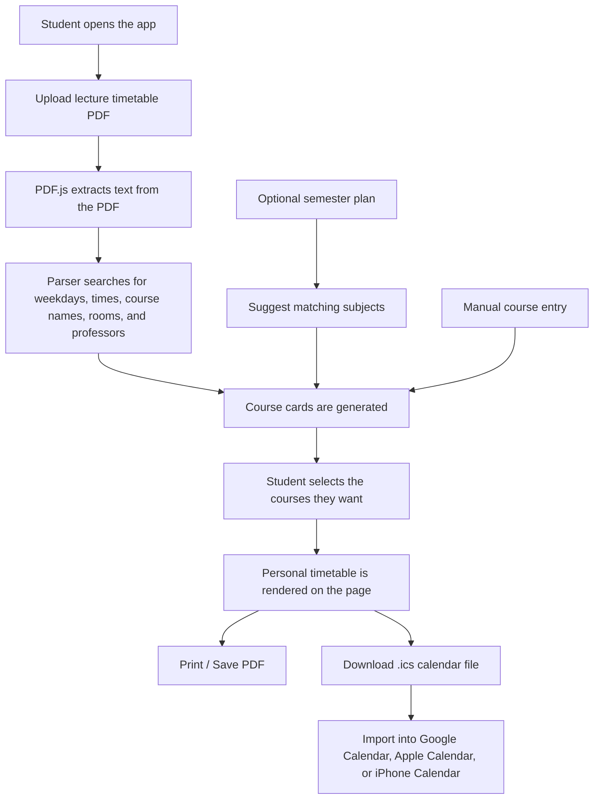
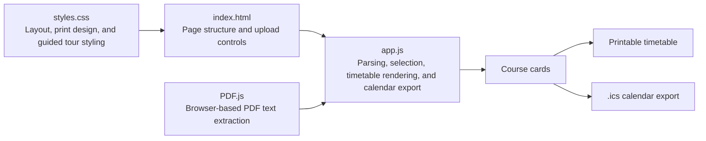

# HSRW Timetable Studio

HSRW Timetable Studio is a small web app that turns a lecture timetable into a personal semester plan. It lets a student upload a timetable PDF, choose the courses they actually want to attend, print a clean timetable, and download a calendar file that works with Google Calendar, Apple Calendar, and iPhone Calendar.

Live website: [https://plankton-app-ilvnc.ondigitalocean.app](https://plankton-app-ilvnc.ondigitalocean.app)

I made this first for personal use because I was too lazy to write down every course by hand. My friend Larry had an even more physical system: he drew lines across the timetable just to track which days he had lectures. That worked, but it was stressful and easy to miss something.

Now both of us can choose our courses once, import them into our phone calendars, and get notifications before class with the course name, professor, room, and time already included.

This project was built with ChatGPT and some project management thinking. For me, it is a good example of AI being useful for the right reasons. AI is not automatically a bad tool. With the right motivation, clear goals, and a real problem to solve, it can help people build things faster. I do not know how long it would have taken me to write all the code alone, but somehow this was done in a few days. It can only get better.

## Why This Exists

University timetables can be difficult to use when students only need a personal selection of courses. A full timetable usually contains many courses, groups, professors, rooms, and time slots. Students still have to do the work of finding their own classes, checking days, and copying everything into a calendar.

This app reduces that manual work.

Instead of writing everything down, the student can:

1. Upload the lecture timetable.
2. Let the app extract possible courses.
3. Select the courses they plan to take.
4. Print a personal timetable.
5. Download an `.ics` calendar file.
6. Import it into the calendar app they already use.

## What It Does

- Reads timetable PDFs directly in the browser.
- Extracts course names, times, weekdays, rooms, and professors where possible.
- Shows courses as selectable cards.
- Allows students to edit course names, professors, rooms, days, and times after import.
- Allows students to choose courses even if some times clash.
- Warns students about timetable clashes without blocking their final choice.
- Builds a personal weekly timetable from the selected courses.
- Creates a print-friendly PDF layout through the browser print dialog.
- Exports an `.ics` calendar file for Google Calendar, Apple Calendar, and iOS Calendar.
- Includes a calendar import guide for students who have not used `.ics` files before.
- Includes a first-time interactive tour to explain how the app works.
- Includes a sample timetable so students can test the tool before uploading their own file.
- Supports manual course entry for cases where the PDF is messy or incomplete.
- Uses an optional semester plan only as a helper for course suggestions.
- Reads files in the browser, so the timetable does not need to be uploaded to a database.

## How To Use It

1. Open the app in a browser.
2. Click **Upload timetable PDF** and choose the official lecture timetable.
3. Wait for the extracted text and course cards.
4. Select the courses you want in your personal timetable.
5. Edit any course card or add a manual course if something was not read correctly.
6. Click **Print / Save PDF** to save or print the timetable.
7. Click **Download Calendar** to get the `.ics` file.
8. Import the `.ics` file into your phone or computer calendar.

The semester plan upload is optional. It is only used to help suggest likely subjects. The real calendar times still come from the lecture timetable.

## How The App Works

The app is built as a static web app, so the main work happens in the browser. There is no server required for parsing the timetable or generating the calendar file.



## Code Flow



## Project Structure

```text
studyplan/
├── index.html                  # Main page structure
├── styles.css                  # App layout, timetable design, print styles, tour styles
├── app.js                      # PDF reading, parsing, rendering, and calendar generation
├── assets/
│   ├── pdf.min.js              # Local PDF.js bundle
│   ├── pdf.worker.min.js       # PDF.js worker
│   └── semester-plan-example.png
├── LICENSE
└── README.md
```

## Why The Calendar Export Matters

The printable timetable is useful, but the calendar export is what makes the tool practical every day. Once the student imports the `.ics` file, their normal calendar app can remind them before class.

That means the student does not have to keep checking a PDF or screenshot. Their phone already knows:

- Course title
- Weekday
- Start and end time
- Professor
- Room or hall
- Repeating semester schedule

## What I Learned

This project taught me that small frustrations can become useful software ideas. The problem was not dramatic: I just did not want to manually copy my timetable. But that small problem affected real student life.

I also learned that AI works best when the person using it still understands the goal. ChatGPT helped with the code, but the idea, testing, corrections, and direction came from the real problem. The tool did not replace thinking. It helped turn the thinking into something usable.

## Limitations

PDF timetables are not always easy to read. Some PDFs store text in strange orders, and some courses may have missing or unclear room/professor information. For that reason, the app still allows manual editing and manual course entry.

The goal is not to make every decision for the student. If courses clash, the app shows them, but the student chooses what to include.

## Future Improvements

- Better timetable parsing for more HSRW PDF formats.
- Cleaner conflict warnings that explain clashes without blocking the student.
- More direct calendar instructions for iPhone, Android, Google Calendar, and Apple Calendar.
- A nicer mobile layout for selecting many courses.
- Saving previous selections locally in the browser.
- More programme-specific presets for HSRW students.

## Presentation Summary

HSRW Timetable Studio is a student-focused web tool that converts lecture timetables into personal schedules. It was created from a real problem: students manually tracking classes from large timetable PDFs. The app uses browser-based PDF parsing, course selection, print styling, and `.ics` calendar generation to make the process easier.

The main message of the project is simple: AI can be helpful when it is used with purpose. This was not about building something random. It was about solving a small but real problem for students.
